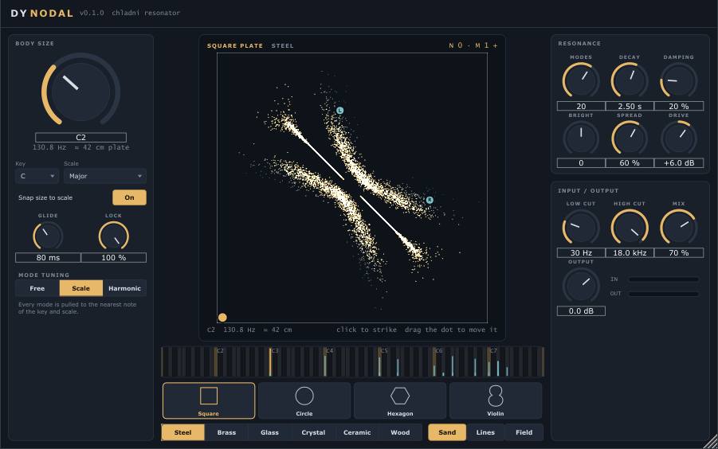

# DY Nodal

A Chladni plate resonator for Ableton Live (VST3, Windows). Whatever you feed it
sets a virtual plate ringing: the plate's own vibration modes resonate with the
input, tuned to your key if you want, and the sand on the plate shows which modes
are sounding.

## What it does

**The sound.** Up to 32 modes of the chosen body, each a resonator at its own
frequency with its own decay. The input hits the body at the **strike point**;
two **pickups** (L / R) listen elsewhere on it, so where you strike and listen
changes the tone, exactly like on a real plate: strike on a nodal line and that
mode stays silent.

**Bodies.** Square, circle, hexagon and violin plates. Square, hexagon and violin
use Chladni's free-plate approximation; the circle uses the free-edge Bessel modes
(zeros of J′ₙ), so its nodal circles sit inside the plate.

**Tuning.**
- **Body size** is the plate's pitch. With **Snap** on it steps through the
  chosen key and scale (15 scales, including just major, slendro and pelog), and
  **Glide** slides between sizes.
- **Mode tuning**: *Free* keeps the body's own inharmonic ratios (bells, gongs,
  glass); *Scale* pulls every mode onto the nearest scale note; *Harmonic* pulls
  them onto whole-number harmonics. **Lock** blends between free and locked.

**Material** (steel, brass, glass, crystal, ceramic, wood) sets how quickly high
modes die, how stiff the overtones are, and the brightness. **Decay**, **Damping**,
**Brightness** and **Modes** refine it. **Spread** moves the pickups apart for
stereo width.

**Input / output.** Low and high cut on what excites the plate, **Drive**, **Mix**,
**Output**. The effect never clips: each mode's amplitude is capped (a scaling of
the resonator state, so it stays a clean sinusoid) and the wet signal goes through
a soft limiter.

**The display.** Click anywhere on the plate to strike it there (it rings even
with no input); drag the brass dot to move the strike point. The sand follows the
real resonator: it slides towards where the time-averaged vibration of all
ringing modes is smallest, and is thrown about where the plate moves most. So the
figure changes with the note, the strike point, and as high modes die away.
*Lines* shows only the nodal lines; *Field* shows vibration strength. The strip
below the plate shows every mode's frequency against the keyboard of your key and
scale, with its current level.

## Using it in Live

Put it on any audio or instrument track like a reverb. Start with Mix around 50 %,
pick a key and scale that match the song, choose *Scale* tuning, and set Body size
to the root. Drums and plucks make it ring like struck metal; pads and vocals
colour it continuously. Everything except the display style is automatable.

## Engine notes

- Each mode is a complex one-pole resonator `z = r·e^{jω}`: unconditionally stable,
  phase-continuous when the frequency glides, and `|state|` is the mode's
  amplitude, which is what the display reads.
- Excitation is scaled by `sqrt(1 − r²)` with a 30 % lean towards impulse
  preservation, so noise keeps roughly the same loudness at any decay while drum
  hits still ring out.
- Control runs every 32 samples on a fixed grid, so output does not depend on the
  host's buffer size (tested).
- `Tests/NodalTests.cpp`: Bessel functions and zeros, mode tables and
  normalisation, scale snapping (including just intonation), resonator pitch,
  decay, noise gain, runaway protection, 20 s stress test, block-size
  independence, bypass, levels.

## Building

From the repository root: `.\scripts\build.ps1`, then
`.\scripts\install.ps1 -Module Nodal` or `.\scripts\package.ps1 -Module Nodal`.
