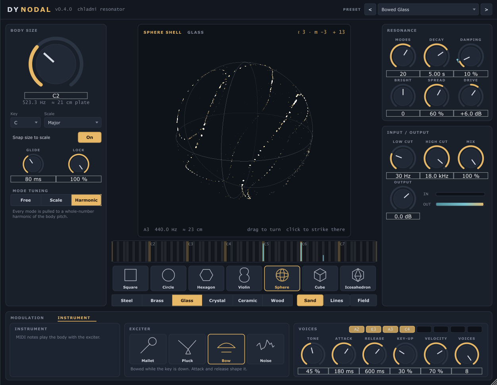

# DY Nodal

A Chladni plate resonator for Ableton Live (VST3, Windows). Whatever you feed it
sets a virtual plate ringing: the plate's own vibration modes resonate with the
input, tuned to your key if you want, and the sand on the plate shows which modes
are sounding. Or play the plate itself from MIDI.

It comes as two plugins built from the same code:

| Plugin | Put it on | What it does |
|---|---|---|
| **DY Nodal** | any audio track, like a reverb | your audio rings the plate; MIDI can retune it or play it; sidechain input |
| **DY Nodal Instrument** | a MIDI track | notes play the plate with a mallet, pluck, bow or breath |

## What it does

**The sound.** Up to 32 modes of the chosen body, each a resonator at its own
frequency with its own decay. The input hits the body at the **strike point**;
two **pickups** (L / R) listen elsewhere on it, so where you strike and listen
changes the tone, exactly like on a real plate: strike on a nodal line and that
mode stays silent.

**Bodies.** Square, circle, hexagon and violin plates. Square, hexagon and violin
use Chladni's free-plate approximation; the circle uses the free-edge Bessel modes
(zeros of J′ₙ), so its nodal circles sit inside the plate. Its lowest figure is
Chladni's two-diameter cross: the one-diameter "mode" of a free disc is the plate
tilting, not vibrating, so it is left out.

**Shells.** A sphere, a cube and an icosahedron, drawn in 3D and slowly turning.
The sphere and icosahedron ring in spherical harmonics (degree ℓ from 2: ℓ = 1
would be the whole shell moving); a perfect sphere's 2ℓ + 1 orders nearly share a
pitch, the icosahedron's facets split them much further apart. The cube uses
standing waves across its faces. Drag to turn the shell; click it to strike at
that point.

**Tuning.**
- **Body size** is the plate's pitch. With **Snap** on it steps through the
  chosen key and scale (15 scales, including just major, slendro and pelog), and
  **Glide** slides between sizes.
- **Mode tuning**: *Free* keeps the body's own inharmonic ratios (bells, gongs,
  glass); *Scale* pulls every mode onto the nearest scale note; *Harmonic* pulls
  them onto whole-number harmonics. **Lock** blends between free and locked.

**Material** (steel, brass, glass, crystal, ceramic, wood) sets how quickly high
modes die, how stiff the overtones are, and the brightness. **Decay**, **Damping**,
**Brightness** and **Modes** refine it. **Spread** moves the pickups apart for
stereo width.

**Input / output.** Low and high cut on what excites the plate, **Drive**, **Mix**,
**Output**. The effect never clips: each mode's amplitude is capped (a scaling of
the resonator state, so it stays a clean sinusoid) and the wet signal goes through
a soft limiter.

**The display.** Click anywhere on the plate to strike it there (it rings even
with no input); drag the brass dot to move the strike point. The sand follows the
real resonator: it slides towards where the plate's time-averaged vibration is
smallest and is thrown about where the plate moves most. Modes ringing at the
same pitch move together, so their shapes add up coherently, with signs set by
the strike point: a degenerate pair becomes one figure turned towards the strike,
and modes that Scale tuning puts on one note make Chladni's hybrid figures. The
sand follows the strongest such group (close rivals blend in), with a trickle of
fresh sand while the plate rings so old figures dissolve into new ones. Quiet
plates sort their sand more slowly, and it stops when the plate falls silent.
On a sphere a whole ℓ family rings together, and the sand draws rings round the
strike point, as the addition theorem says it must; the corner label then reads
"rings round the strike". When modes of different shapes share a pitch the label
adds "+ n".
*Lines* shows only the nodal lines; *Field* shows vibration strength. The strip
below the plate shows every mode's frequency against the keyboard of your key and
scale, with its current level.

**Modulation** (the strip along the bottom).
- **Two LFOs**: sine, triangle, saw, square, sample & hold, and *Drift* (smooth
  random). Free in Hz, or **Sync**ed to the song: a synced LFO takes its phase
  from the song position, so it plays back identically every time, random shapes
  included.
- **Input follower**: the input's level (with attack and release) as a third
  source, and **Pitch follow**, which listens for the note you sing or play and
  retunes the body to it (snapped to the scale when Snap is on). Drum hits in the
  input also throw the sand.
- Each source picks a target: body pitch (in scale steps when Snap is on),
  decay, damping, brightness, strike X / Y, spread, lock, mix or drive. The knob
  being moved shows a ring in the source's colour (white when several sources
  share it), and a modulated strike point leaves a hollow handle where it is set.

**Playing it** (the *Play* tab, *Instrument* in the instrument plugin).
- **Play mode**: *Effect* (the input rings the body, MIDI ignored), *Key follow*
  (the input rings it, MIDI notes retune it), *Instrument* (MIDI notes play it).
- **Exciters** for notes: *Mallet* and *Pluck* strike once (Tone goes from soft
  and dark to hard and bright); *Bow* and *Noise* keep exciting while the key is
  down, shaped by Attack and Release; *Input* (effect only) lets the audio input
  sound through each held note, so the plate plays your audio at the notes you
  hold.
- **Voices**: up to 8, each a whole body of up to 32 modes. At 1 it is mono and
  legato notes glide (Glide sets the time). **Key-up** is how much letting go of
  a key stops the ring: 0 rings on like a bell, 100 % stops it like a damped
  string. **Velocity** sets how much velocity changes loudness and brightness.
  Sustain pedal and pitch bend (±2) work; notes start on their exact sample.
- Mode tuning still applies: in *Scale* the overtones are pulled into the key,
  but the note you play is never moved.
- The strip of keys under the plate is a keyboard in Key follow and Instrument
  mode: click or drag to play (higher on the key is louder). A tap on the plate
  plays the Body size note.
- **Sidechain** (effect): *Excites* rings the plate with the sidechain instead of
  the main input (put it on a pad and send it the drums), *Envelope* makes the
  input follower listen to the sidechain (duck the plate with the kick).

**Presets.** Twenty-two factory starting points in the header (also listed as the
plugin's programs in the host): steel plate, brass bowl, glass harmonica, gamelan
slendro, violin top, crystal shimmer, stepping bell, ducked plate, dark gong, tuned
drum room, follow the singer, singing sphere, icosa gamelan, crystal cube,
orbiting strike, and for playing: mallet bells, plucked plate, bowed glass,
breathing bowl, mono glide gong, key follow drone and sidechain ring.

## Using it in Live

Put **DY Nodal** on any audio or instrument track like a reverb. Start with Mix
around 50 %, pick a key and scale that match the song, choose *Scale* tuning, and
set Body size to the root. Drums and plucks make it ring like struck metal; pads
and vocals colour it continuously. Everything except the display style is
automatable.

- **Play the effect from MIDI** (Key follow or Instrument mode): on a MIDI track
  set *MIDI To* to the DY Nodal track and choose "DY Nodal" in the second box.
- **Sidechain**: set Play > Sidechain, then pick the source track in the device's
  sidechain section in Live.

Put **DY Nodal Instrument** on a MIDI track and play; the Mix knob starts at
100 %.

## Engine notes

- Each mode is a complex one-pole resonator `z = r·e^{jω}`: unconditionally stable,
  phase-continuous when the frequency glides, and `|state|` is the mode's
  amplitude, which is what the display reads.
- Excitation is scaled by `sqrt(1 − r²)` with a 30 % lean towards impulse
  preservation, so noise keeps roughly the same loudness at any decay while drum
  hits still ring out.
- Control runs every 32 samples on a fixed grid, so output does not depend on the
  host's buffer size (tested, with every modulation source running).
- LFO randomness is a hash of the cycle number, not a running random generator,
  so synced sample & hold and drift repeat exactly on every playback.
- Pitch follow is YIN on a 12 kHz copy of the input (40 Hz to 1 kHz, a new
  estimate every ~21 ms); it only accepts notes above 80 % clarity.
- `Tests/NodalTests.cpp`: Bessel functions and zeros, mode tables and
  normalisation, scale snapping (including just intonation), resonator pitch,
  decay, noise gain, runaway protection, 20 s stress test, block-size
  independence, bypass, levels, LFO shapes and song-position sync, envelope
  timing, transient detection, pitch detection (sines, a sawtooth, noise,
  silence), modulation end to end (scale-stepped pitch, pitch follow,
  envelope ducking), 3D picking (a point on a turned shell back to the
  strike knobs, for all three shells from random views), and playing: pitch
  of a played note, overtones locked without moving the note, levels of every
  exciter, bow sustain and let-go, key-up damping, polyphony and stealing,
  chords, mono glide, sustain pedal, pitch bend, taps, voice retirement, key
  follow, both sidechain modes, and block-size independence with notes landing
  mid-block.
- Instrument voices share the per-block work (strike and pickup shapes, damping,
  tilt); each only adds its own frequencies and decays, so 8 voices of 32 modes
  cost little more than the modes themselves.

## Building

From the repository root: `.\scripts\build.ps1`, then
`.\scripts\install.ps1 -Module Nodal` or `.\scripts\package.ps1 -Module Nodal`.
`.\scripts\nodal-test.ps1 -Preset 5 -Strike 2` opens the standalone on a preset
and taps the plate every two seconds, for checking the display hands-free;
`-Instrument -Notes "57,64,69" -Tab 1` opens the instrument, plays that chord on
each tick and shows the Instrument tab.
