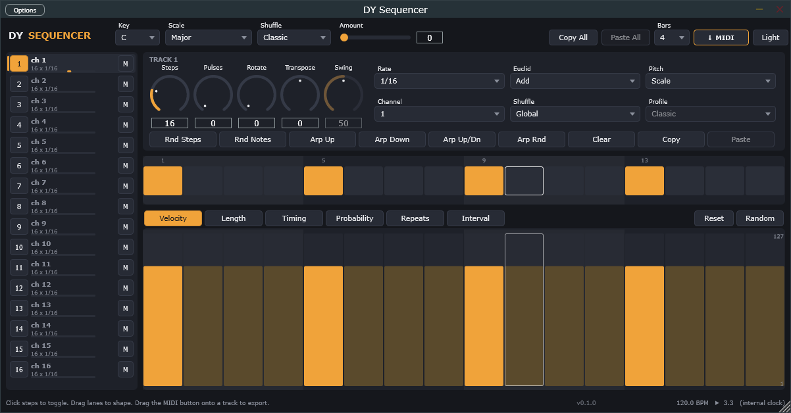
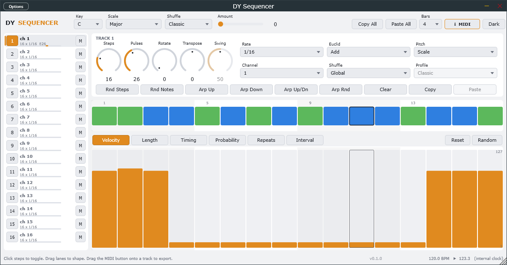

# DY Sequencer

A 16-track Euclidean / scale-aware MIDI step sequencer as a VST3 (and standalone
app), built with JUCE. Designed for Ableton Live but works in any VST3 host.





## Features

- **16 independent tracks**, each with its own length (1–64 steps), rate
  (1/4 … 1/64 incl. triplets) and MIDI channel. Different lengths cycle
  against each other as polymeters.
- **Euclidean sequencing** per track: pulses + rotate, in three modes —
  *Off* (manual steps only), *Add* (manual ∪ Euclid), *Only* (Euclid replaces manual).
- **Scale-locked pitch**: global Key (12) and Scale (14 scales), per-track
  transpose in scale degrees, per-step **Interval** lane in scale degrees.
  Or *Fixed* pitch mode for drums (one MIDI note per track).
- **Six per-step lanes**: Velocity, Length (5–200 % of a step), Timing
  (±64 ms), Probability, Repeats (1–8 ratchets), Interval (±24 degrees).
- **8 shuffle profiles** (Classic, Shuffle, Lazy, Push, Lean, Drunk, Roll,
  Half-Time), global amount, and per-track *Global / Off / Custom* swing.
- **Generators**: random steps, random notes, arpeggio up / down / up-down /
  random, per-lane randomise and reset.
- **Copy / paste** a track or the whole pattern (destination keeps its channel,
  on/off and mute).
- **MIDI export**: drag the `MIDI` button onto a DAW track to drop a multi-track
  `.mid` (1–16 bars); click it to save as a file.
- **Resizable UI** 50 %–400 %, dark and light themes, tooltips everywhere.
- Every knob and combo is a host-automatable parameter (212 total); per-step data
  is saved with the plugin state.
- Sample-accurate transport sync (PPQ based), loop-point aware, drops nothing on
  transport jumps. Standalone app free-runs on an internal 120 BPM clock.

## Building (Windows)

Requirements: Visual Studio 2022 with the C++ workload (its bundled CMake and
Ninja are used), internet access on first configure (JUCE 9.0.2 is downloaded
into `build/_deps`).

```powershell
.\scripts\build.ps1              # Release: VST3 + Standalone + engine tests
.\scripts\build.ps1 -TestsOnly   # engine tests only, no JUCE download
.\scripts\build.ps1 -Config Debug
```

Outputs land in `build\DYSequencer_artefacts\Release\`:

- `VST3\DY Sequencer.vst3`
- `Standalone\DY Sequencer.exe`

The engine (`Source/Engine`) has no JUCE dependency and is covered by
`Tests/EngineTests.cpp` (~1,750 checks: Euclid, scales, swing, timing, transport
jumps, block-size independence, offline render).

## Installing into Ableton Live

```powershell
.\scripts\install.ps1        # -> C:\Program Files\Common Files\VST3 (asks for admin)
.\scripts\install.ps1 -User  # -> %LOCALAPPDATA%\VST3, then set that as Live's custom VST3 folder
```

Then in Live: *Preferences → Plug-Ins → Rescan*. The plugin shows up under
**VST3 → dy → DY Sequencer** as an *instrument*.

### Routing 16 tracks in Live

Live only lets a plugin emit MIDI onto the track it sits on, so the standard
pattern is one "brain" track plus receiver tracks:

1. Create a MIDI track, drop **DY Sequencer** on it. It outputs silence as audio;
   it's the sequencer.
2. For each instrument you want to drive, create a MIDI track and set
   **MIDI From** to the brain track, and in the second dropdown pick
   **DY Sequencer** (the plugin's MIDI output, not *Post FX*).
3. Set that receiver track's monitoring to **In**.
4. The receiver gets *all* 16 channels. Give each DY track its own channel and
   either use a multi-timbral instrument (Drum Rack chains / Instrument Rack
   with chain MIDI-channel filtering) or put a channel filter in front of each
   instrument. A track set to *Fixed* pitch pairs naturally with a Drum Rack pad.

Live's transport drives the sequencer: press play in Live, it plays; loop the
arrangement and the pattern follows the loop.

## Project layout

```
Source/
  Engine/        pure C++17 sequencer core (no JUCE) — Euclid, Scale, Shuffle,
                 Pattern (lock-free step data), Sequencer (PPQ clock → events),
                 Generator
  Params/        AudioProcessorValueTreeState layout + cached raw pointers
  UI/            Theme/LookAndFeel, HeaderBar, TrackList, TrackPanel, StepGrid,
                 LaneEditor, StatusBar
  PluginProcessor.*   transport handling, state, clipboard, MIDI export
  PluginEditor.*      fixed logical layout (1200×600) scaled to the window
Tests/EngineTests.cpp
scripts/build.ps1, install.ps1, shot.ps1 (PrintWindow screenshot), click.ps1
```

### How timing works

Each track keeps a cursor over an absolute step timeline `k · division` (PPQ).
Per block the engine schedules every step whose nominal time falls before
`blockEnd + maxOffset` (swing + 64 ms micro-timing), computes its real time
(swing curve × amount, plus the step's Timing lane) and emits it once that time
lands inside a block. Steps already in the past after a transport jump are
dropped rather than played late. Note-offs are tracked in PPQ; stopping the
transport releases everything.

## Roadmap ideas

- Pattern banks (8 patterns per track, quantised switching)
- Incoming MIDI note → live transposition / scale root
- Per-track velocity / probability macros, humanise
- Push 2/3 & Launchpad grid control
- macOS / AU build (the CMake project is already cross-platform)

## License

Project code: MIT. Built on [JUCE](https://juce.com) under AGPLv3 — distributing
closed-source binaries requires a JUCE commercial licence.
