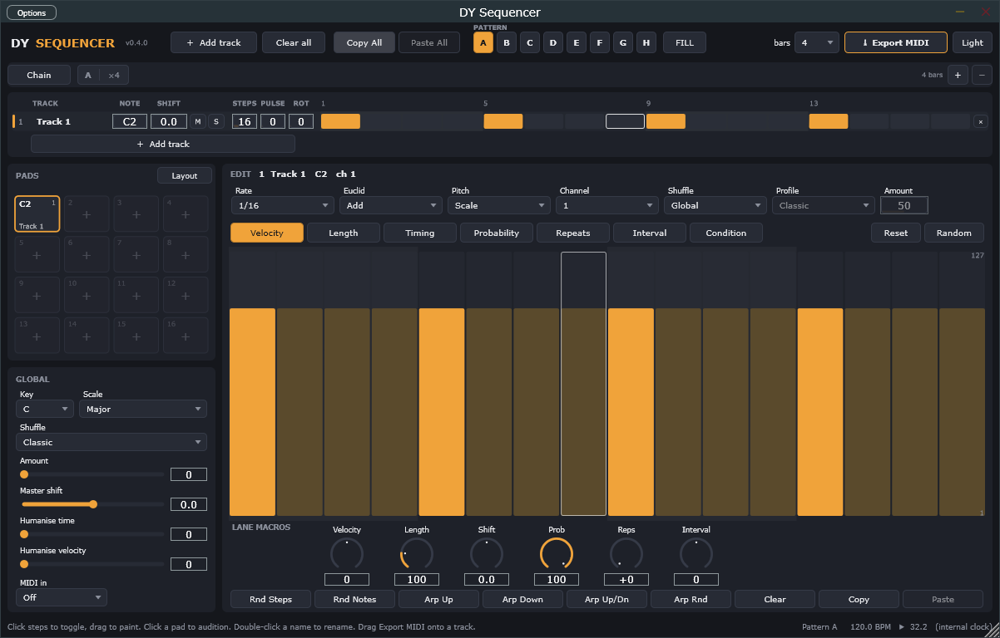

# DY Sequencer

A 16-track Euclidean / scale-aware MIDI step sequencer as a VST3 (and standalone
app), built with JUCE. Designed for Ableton Live but works in any VST3 host.



## Features

**Tracks**
- Up to **16 tracks**, added one at a time (**+ Add track** or click an empty pad),
  each with its own length (1–64 steps), rate (1/4 … 1/64 incl. triplets), MIDI
  channel, name, **Mute**, **Solo** and timing **Shift** (±64 ms). Different
  lengths cycle against each other as polymeters.
- **All tracks at once**: every track is a row in the overview grid — name, note,
  shift, M/S, Steps / Pulses / Rotate, then its step cells. Click a cell to
  toggle, drag to paint. Scrolls past 10 tracks.
- **Euclidean sequencing** per track: Pulses + Rotate, in three modes — *Off*
  (manual only), *Add* (manual ∪ Euclid), *Only* (Euclid replaces manual).

**Pitch**
- **Scale mode**: global Key (12) and Scale (14), per-track transpose in scale
  degrees, per-step **Interval** lane in degrees. **Fixed mode**: one MIDI note
  per track (drums).
- **Pads**: 4×4, one per track, showing note + name and lighting up on every hit.
  Click a pad to select + audition its note (works with the transport stopped).
  **Layout** presets assign all 16 notes at once: GM Drums, Chromatic from C1
  (Ableton Drum Rack), or Melodic.

**Patterns A–H**: eight banks holding step data **and each track's length,
Pulses, Rotate and Euclid mode** — so pattern B can be a 12-step Euclidean fill
while A is a straight 16. Selecting a pattern while playing switches at the
**next bar line** (instantly when stopped); until then you are already editing
the new one. The pattern is a host parameter, so Live can automate it. Copy All /
Paste All moves a pattern between banks.

**Chain (song mode)**: the strip under the header. Turn **Chain** on and the
sequencer plays the entries in order — `A ×4 → B ×9 → D ×4` — looping. The chain
follows the host position (bar number modulo chain length), so loops and jumps in
Live stay in sync and there is nothing to "restart". Click a letter to cycle its
pattern (shift = back), drag the number for 1–16 bars, `+` / `−` add or remove
entries, click a number to jump to editing that pattern. **Export MIDI** renders
the whole chain in this mode.

**Per step** (seven lanes): Velocity, Length (5–200 %), Timing (±64 ms),
Probability, Repeats (1–8 ratchets), Interval (±24 degrees) and **Condition**:
`1:2 … 4:4, 1:8, 8:8` (play on the n-th pass of m), `Fill` / `!Fill` (the header
**FILL** button, hold it — automatable), `1st` (first pass after play / jump),
`Prev` / `!Prev` (did the previous step fire). Drag to draw, sweep horizontally
to paint, double-click to reset.

**Lane macros** per track — knobs that offset a whole lane on top of the step
values: Velocity ±64, Length 25–400 %, Shift ±64 ms, Prob 0–100 %, Reps +0–7,
Interval (transpose). All host-automatable.

**Groove**: 8 shuffle profiles (Classic, Shuffle, Lazy, Push, Lean, Drunk, Roll,
Half-Time), global amount, per-track *Global / Off / Custom*, a **Master shift**
(±64 ms) for the whole sequencer, and **Humanise** (random timing up to ±30 ms
and velocity up to ±32 per hit, reproducible in exports).

**MIDI in** (Global panel): *Key follow* — the last note played into the plugin
transposes every Scale-mode track (C3 = none). *Chord follow* — the notes you
hold become the chord, and the **Interval** lane walks through it (0 = lowest
held note, 1 = next, wrapping into higher octaves). Latched: release the keys and
the chord stays until you play the next one. Drum (Fixed) tracks are unaffected
either way. The Arp generators produce consecutive chord degrees in this mode.

**Generators**: random steps, random notes, arpeggio up / down / up-down /
random, per-lane randomise and reset. **Clear all** with confirmation.

**Workflow**: copy / paste a track or the whole pattern (destination keeps its
channel / on / mute / solo); **Export MIDI** — drag the button onto a DAW track
to drop a multi-track `.mid` (1–16 bars), or click it to save a file. Resizable
50 %–400 %, dark and light themes, tooltips everywhere. 331 automatable
parameters; all eight patterns, the chain, names and UI preferences are saved with
the plugin state (older sets load into bank A).

**Timing**: sample-accurate PPQ transport sync, loop-point aware, deterministic
across block sizes. The standalone app free-runs at 120 BPM.

## Installing (Windows, Ableton Live)

1. Download `DY-Sequencer-<version>-win-x64.zip` from the
   [Releases](https://github.com/buttlerkid/sequencer/releases) page (or build it,
   see below).
2. Unzip and copy the **`DY Sequencer.vst3`** folder into
   `C:\Program Files\Common Files\VST3\`.
3. In Live: **Options → Preferences → Plug-Ins**, make sure **Use VST3 Plug-In
   System Folders** is **On**, then **Rescan**.
4. In the browser: **Plug-Ins → VST3 → dy → DY Sequencer**. Drag it onto a MIDI
   track.

Requirements: Windows 10/11 x64, Live 10.1+ (any VST3 host). No runtime
installers needed — the plugin is statically linked.

### Hearing it

The plugin makes MIDI, not sound. On a second MIDI track:

- **MIDI From** → the DY Sequencer track, second dropdown → **DY Sequencer**
- **Monitor** → **In**
- drop any instrument (Operator, Drum Rack, …)
- press **play** in Live

For 16 separate instruments, repeat per receiver track; each receiver gets all
channels, so give each DY track its own channel and filter by channel on the
receiving side (Drum Rack / Instrument Rack chains, or a channel-filter device).

## Building

Visual Studio 2022 with the C++ workload (its bundled CMake + Ninja are used).
First configure downloads JUCE 9.0.2 into `build/_deps`.

```powershell
.\scripts\build.ps1              # Release: VST3 + Standalone + engine tests
.\scripts\build.ps1 -TestsOnly   # engine tests only (no JUCE)
.\scripts\install.ps1            # copy the VST3 into Common Files\VST3 (asks for admin)
.\scripts\package.ps1            # zip for sharing -> dist\DY-Sequencer-<version>-win-x64.zip
```

The engine (`Source/Engine`) has no JUCE dependency and is covered by
`Tests/EngineTests.cpp` (2,032 checks: Euclid, scales, swing, lanes, macros,
conditions, pattern switching, chains, per-pattern settings, chord follow,
humanise, timing, transport jumps, block-size independence, offline render).

## Project layout

```
Source/
  Engine/        pure C++17 core (no JUCE): Euclid, Scale, Shuffle, Pattern
                 (lock-free step data), Sequencer (PPQ clock -> events), Generator
  Params/        AudioProcessorValueTreeState layout + cached raw pointers
  UI/            Theme/LookAndFeel, HeaderBar (patterns, FILL), ChainStrip,
                 OverviewGrid (all tracks), PadsPanel, EditPanel (settings, lanes,
                 macros, generators), GlobalPanel, LaneEditor, StatusBar
  PluginProcessor.*   transport, solo resolution, audition queue, state,
                      clipboard, MIDI export
  PluginEditor.*      fixed logical layout (1200x740) scaled to the window
Tests/EngineTests.cpp
scripts/        build.ps1, install.ps1, package.ps1, shot.ps1, click.ps1, lclick.ps1
```

### How timing works

Each track keeps a cursor over an absolute step timeline `k · division` (PPQ).
Per block the engine schedules every step whose nominal time falls before
`blockEnd + lookahead`, where the lookahead is exactly what the track's negative
offsets need (earliest Timing value, shift, master shift, humanise, half a step
for push-swing), so Fill, conditions and pattern switches react as late as
possible. Steps already in the past after a transport jump are dropped rather
than played late. Which pattern a step comes from is decided per step by a
`PatternSchedule` (a bar-indexed chain, or a base pattern plus a switch at a bar
line), so switches and chains are exact to the step. Note-offs are tracked in
PPQ; stopping the transport releases everything.

Length / Pulses / Rotate / Euclid live inside each pattern; the per-track host
parameters are a window onto the edited pattern (a listener writes parameter
changes into the pattern, a timer pushes the pattern's values back into the
parameters when you switch), and the audio thread reads the pattern directly.

## Roadmap ideas

- Pattern-level mutes / scenes, chain entry repeats via automation
- Scale detection from MIDI in, chord voicing modes (spread / inversions)
- Per-track swing-to-grid nudge, step-level ratchet curves
- Push / Launchpad grid control
- macOS / AU build (the CMake project is already cross-platform)

## License

Project code: MIT. Built on [JUCE](https://juce.com) under AGPLv3 — distributing
closed-source binaries requires a JUCE commercial licence.
