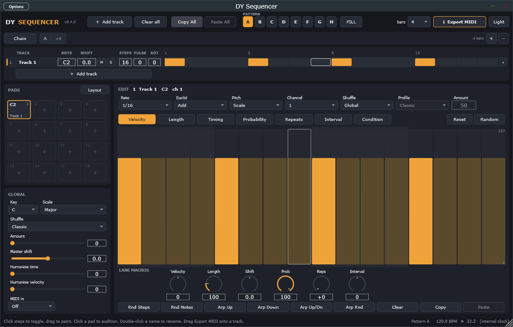

# DY plugin suite

Music tools for Ableton Live (and any VST3 host), built with JUCE. Each plugin is
a module in its own folder; they share one JUCE checkout, one build and one set of
scripts.

| Module | What it is | Status |
|---|---|---|
| [Sequencer](Sequencer/README.md) | DY Sequencer: 16-track Euclidean, scale-aware MIDI step sequencer with patterns, chains, conditions and chord follow | v0.4.0 |
| [Nodal](Nodal/README.md) | DY Nodal: Chladni plate resonator. Up to 32 tuned plate modes, body size stepped through a scale, six materials, LFOs / input follower / pitch follow, and GPU sand that shows which modes are ringing | v0.2.0 |



## Building (Windows)

Visual Studio 2022 with the C++ workload (its bundled CMake + Ninja are used).
The first configure downloads JUCE 9.0.2 into `build/_deps`.

```powershell
.\scripts\build.ps1                       # every module: VST3 + Standalone, plus engine tests
.\scripts\build.ps1 -TestsOnly            # engine tests only (no JUCE)
.\scripts\install.ps1 -Module Nodal       # copy a VST3 into Common Files\VST3 (asks for admin)
.\scripts\package.ps1 -Module Sequencer   # zip for sharing -> dist\DY-Sequencer-<version>-win-x64.zip
```

Outputs: `build\<Module>\DY<Module>_artefacts\Release\{VST3,Standalone}`.

## Layout

```
CMakeLists.txt      suite: fetches JUCE once, shared compile settings, adds each module
Sequencer/          DY Sequencer (Source/, Tests/, README.md)
Nodal/              DY Nodal
scripts/            build, install, package, and UI test helpers (shot, click, lclick)
docs/               screenshots
```

Adding a module: create `<Name>/CMakeLists.txt` with `set(DY_<NAME>_VERSION x.y.z)`,
a `juce_add_plugin(DY<Name> ...)` target and `dy_plugin_defaults(...)`, then
`add_subdirectory(<Name>)` in the root CMakeLists and add it to the `-Module` lists
in `scripts/install.ps1` and `scripts/package.ps1`.

## License

Project code: MIT. Built on [JUCE](https://juce.com) under AGPLv3; distributing
closed-source binaries requires a JUCE commercial licence.
